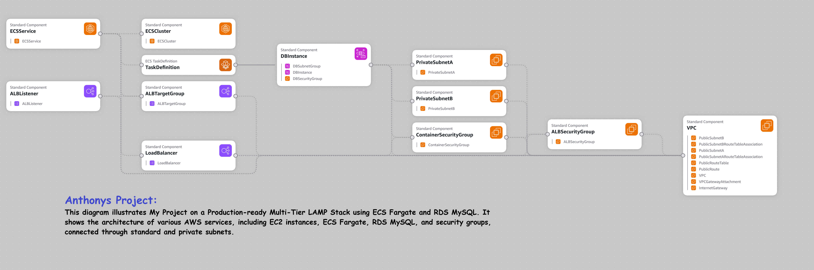

# Production-Ready Multi-Tier LAMP Stack on AWS

This repository contains a CloudFormation template and configuration files to deploy a highly available, multi-tier LAMP stack utilizing **AWS ECS Fargate** for the application tier and **Amazon RDS MySQL** for the database tier.

## Architecture Diagram

## Features
* **Compute:** AWS ECS Fargate for serverless container execution.
* **Database:** Managed Amazon RDS MySQL instance deployed across secure subnets.
* **Networking & Security:** Isolated public and private subnets with strictly configured Security Groups.
* **Load Balancing:** AWS Application Load Balancer (ALB) routing traffic safely to your containers.

* **AWS Services Used**
Amazon VPC,
Amazon ECS,
AWS Fargate,
Elastic Load Balancing,
Amazon RDS,
AWS IAM,
Amazon ECR,
AWS CloudFormation,

**Key Features**
Infrastructure as Code using CloudFormation,
Multi-AZ deployment for high availability,
Containerized application deployment with ECS Fargate,
Internet-facing Application Load Balancer,
Secure MySQL database in private subnets,
Security groups enforcing least-privilege access,
Scalable and fault-tolerant architecture,

**Deployment**
Deploy the CloudFormation template to automatically provision:
VPC and networking resources,
Security groups,
ECS Cluster and Fargate Service,
Application Load Balancer,
RDS MySQL database,
Supporting IAM roles,

**Outcome**
The deployed application is accessible through the Load Balancer URL provided in the CloudFormation stack outputs, delivering a secure, scalable, and production-ready LAMP environment on AWS.
